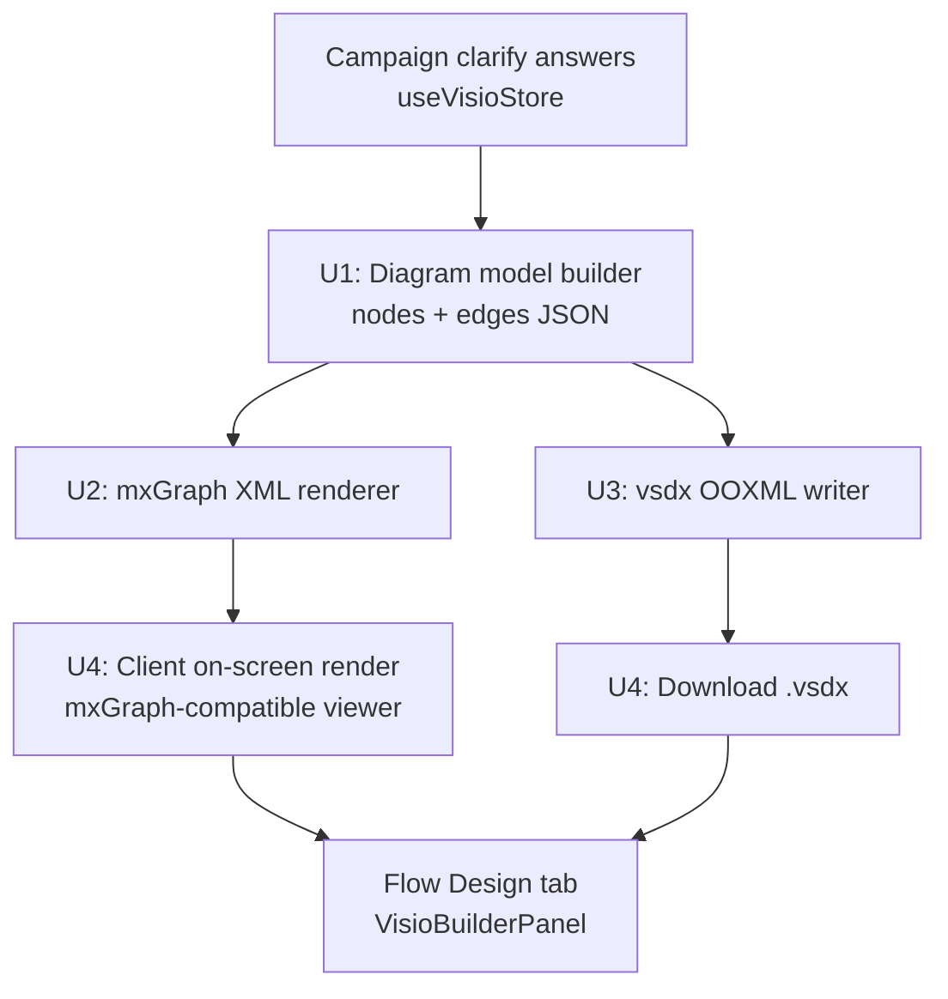
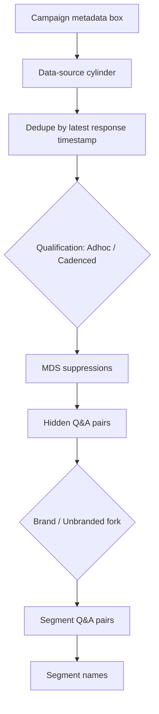

# Segmentation Diagram Generator - Plan

## Goal Capsule

- **Objective:** a Solution Architect opens the Flow Design tab and sees a real segmentation diagram for the current campaign, generated from its own data, instead of the static reference PDF everyone sees today.
- **Means:** build the diagram as a draw.io-shaped node/edge model, render it on screen with an mxGraph-compatible client library, and export it as a real `.vsdx` file built directly as an OOXML zip (KTD2).
- **Authority hierarchy:** this plan's Requirements and Key Technical Decisions govern; an implementer resolves ambiguity by re-reading the cited R/KTD, not by inventing new product scope.
- **Stop conditions:** stop and ask before extending scope into the Email Journey per-segment component (KTD4) or before adding a heavy runtime dependency (Electron, a JVM, a hosted conversion service) to produce the `.vsdx` (KTD2).
- **Execution profile:** single-repo, server + client change, no migrations, no auth surface.
- **Tail ownership:** the last unit (U6) owns wiring the new generator into the existing Visio store lifecycle; nothing past it is required for this plan's Definition of Done.

---

## Product Contract

### Summary

Generate a real segmentation flow diagram per campaign, reverse-engineered from `SOP_FlowPlanner_Segmentation_DRAFT_V3_08092026.xlsx` (repo root), and show it in the Flow Design tab in place of the static `/visio-cropped.pdf`. Output is a genuine `.vsdx` file, downloadable and also rendered inline. Scope stops at the SOP's "Segmentation" component (through segment names); the SOP's separate "Email Journey Per segment" component is a follow-up.

### Problem Frame

The Flow Design tab (`accelerate-app/client/src/components/VisioBuilderPanel.tsx`) currently shows one static file, `client/public/visio-cropped.pdf`, for every campaign once the clarify Q&A (`useVisioStore.ts`'s `VB_CLARIFY_QUESTIONS`) is answered. It never reflects the campaign's own data. The user added an SOP workbook this session that documents, block by block, how the segmentation diagram is actually built by hand today — campaign metadata, a data-source cylinder, a dedupe/disposition step, MDS suppression, hidden and segment-level Q&A pairs, a brand/unbranded fork, and segment names. That SOP is the reverse-engineering source for a generator.

### Requirements

- R1. When a campaign's Flow Design tab is opened and its segmentation inputs are available, the system generates a `.vsdx` segmentation diagram for that campaign instead of showing the static reference PDF.
- R2. The generated diagram renders inline in the Flow Design tab, not download-only.
- R3. The diagram represents the SOP's Segmentation component blocks: campaign metadata, data-source, dedupe/disposition, MDS suppression, hidden Q&A pairs, brand/unbranded fork, segment Q&A pairs, and segment names.
- R4. The SOP's Email Journey per-segment component (per-segment email cadence, resend rules, FUSE ID, Metadata ID, Go-Live) is not represented in this diagram generator.
- R5. The `.vsdx` file is downloadable from the Flow Design tab.
- R6. A segmentation input the SOP calls for but this app does not yet collect (for example, MDS suppression detail, disposition codes, or a segment name with no survey sheet on file) renders as an explicit placeholder in the diagram rather than blocking generation.

### Key Decisions

- **Generate a true `.vsdx` from the first draft, not draw.io-XML-only.** The diagram-building logic (KTD1) is the same regardless of output format; only the file-format step changes, so deferring `.vsdx` would not have saved rework. `(session-settled: user-directed — chosen over shipping draw.io-native XML now and deferring real `.vsdx` export: the user asked directly why not do `.vsdx` now, and the answer is that deferring buys nothing once the lightweight OOXML approach removes the heavy-runtime reason to wait)` Governs R1, R5.
- **No draw.io app, Electron, or JVM dependency for `.vsdx` export.** `.vsdx` is a documented OOXML zip, buildable directly with a general-purpose zip/XML library — the same pattern general-purpose libraries use for `.pptx`/`.docx`. `(session-settled: user-directed — chosen over a headless draw.io export tool: the user asked whether a free library exists instead of the heavier Electron/JVM path, and it does)` Governs R1, R5.

### Scope Boundaries

- The SOP's Email Journey per-segment component (per-segment email cadence, resend rules, FUSE ID, Metadata ID, Go-Live) is out of scope for this plan.
- Visual styling that pixel-matches the SOP's own screenshots is out of scope; the diagram must be structurally correct (right blocks, right branches, right labels), not a visual clone.
- Adding a managed/hosted conversion service for `.vsdx` (as an alternative to the direct OOXML approach) is out of scope unless the direct approach proves infeasible during U3.

#### Deferred to Follow-Up Work

- Email Journey per-segment diagram generation, once this plan's segmentation diagram ships and its data model is proven.
- Editable on-screen diagram interaction (drag, reflow) — this plan's on-screen render is read-only.

---

## Planning Contract

### Key Technical Decisions

- KTD1. **One diagram model feeds both outputs.** A single server-side node/edge JSON model (U1) is the source of truth; the on-screen mxGraph XML (U2) and the `.vsdx` writer (U3) both render from it. Rationale: keeps the two outputs from drifting apart, and lets a future Email Journey generator (deferred) reuse the same builder pattern. Governs R1, R2, R3, R5.
- KTD2. **`.vsdx` is built directly as an OOXML zip, not via draw.io app/Electron/JVM.** `(session-settled: user-directed — chosen over headless draw.io conversion: removes a heavy runtime dependency this app's Render free-tier deploy cannot easily absorb)`. Instantiates the Product Contract's matching Key Decision. Governs R1, R5.
- KTD3. **On-screen rendering uses an mxGraph-compatible client library** (e.g. `@maxgraph/core`) to render the same mxGraph XML U2 emits, read-only. This is the one well-documented option for browser-side rendering of draw.io-shaped diagrams; no real alternative was found. Governs R2.
- KTD4. **Scope stops at "Segment names."** The SOP's own component boundary (Segmentation vs. Email Journey Per segment, each independently numbered `Block 1...`) is the scope line. Governs R4.
- KTD5. **Missing inputs render as placeholders, not blockers.** Mirrors the SOP's own first-draft language ("leave content blank in first draft," "Keep TBD"). Governs R6.

### Assumptions

- The SOP's DTC-rule and HCP-rule columns describe the same block structure with audience-specific branching values, not two different diagrams — U1's model takes an audience parameter rather than branching into two separate generators. Flag this if the SOP images (not extracted as text) show otherwise.
- The existing four `VB_CLARIFY_QUESTIONS` answers (segment source, cutoff date, last-touch email, fulfilment code) map onto the SOP's campaign-metadata and data-source blocks; U5 extends this set rather than replacing it.
- "Segment names" in scope means the diagram shows the segment-name node(s) themselves, sourced from campaign goal text or survey sheet data when available and `TBD` otherwise (per SOP) — it does not require building segment-name derivation logic beyond what the existing chat-driven Visio flow already captures.

### High-Level Technical Design

The Segmentation component's own block sequence (SOP-sourced), which U1 must encode as the diagram model's node graph:

### Sequencing

U1 has no dependencies. U2 and U5 depend on U1. U3 depends on U1 and U2 (shares shape/position data). U4 depends on U2 and U3. U6 depends on U4 and U5.

---

## Implementation Units

### U1. Segmentation diagram model

**Goal:** a pure function that takes a campaign's segmentation inputs and returns a node/edge diagram model matching the SOP's Segmentation component block sequence.

**Requirements:** R1, R3, R6 (KTD1, KTD4, KTD5)

**Dependencies:** none

**Files:**
- `accelerate-app/server/segmentation/diagramModel.js` (new)
- `accelerate-app/server/segmentation/diagramModel.test.js` (new)

**Approach:**
- Define the node/edge shape as plain JSON: each node carries an id, a block label (from the SOP: campaign metadata, data source, dedupe/disposition, MDS suppression, hidden Q&A, brand/unbranded fork, segment Q&A, segment names), a shape hint (box, cylinder, diamond), and its text content; each edge carries a source id, target id, and optional branch label (e.g. "DTC", "HCP", "Adhoc", "Cadenced").
- Read the SOP workbook (`SOP_FlowPlanner_Segmentation_DRAFT_V3_08092026.xlsx`, repo root) during implementation to confirm exact block wording and the DTC/HCP branch differences the extracted text in this plan's Sources section only partially captured (the workbook embeds reference screenshots alongside the text cells).
- A missing input (KTD5) renders its node's text content as `TBD` rather than omitting the node.

**Test scenarios:**
- Full inputs (all SOP fields present) produce a diagram model with one node per Segmentation block and edges matching the flowchart in this plan's High-Level Technical Design.
- A missing MDS suppression detail renders that block's node with placeholder text, not a missing node.
- A DTC audience input produces the DTC-rule branch values; an HCP audience input produces the HCP-rule branch values, per the assumption in Planning Contract.
- Test expectation: none for the workbook-reading step itself if implemented as a one-time reference lookup rather than runtime file I/O — cover only the resulting `diagramModel.js` behavior.

**Verification:** running the unit's tests produces the expected node/edge counts and labels for at least one full-input case and one placeholder case.

---

### U2. mxGraph XML renderer

**Goal:** convert a diagram model (U1's output) into draw.io-compatible mxGraph XML.

**Requirements:** R1, R2 (KTD1, KTD3)

**Dependencies:** U1

**Files:**
- `accelerate-app/server/segmentation/mxGraphXml.js` (new)
- `accelerate-app/server/segmentation/mxGraphXml.test.js` (new)

**Approach:**
- Map each diagram-model shape hint (box, cylinder, diamond) to its mxGraph `style` string equivalent.
- Compute simple top-to-bottom node positions from the model's edge order; this is a first draft, not a layout engine — a straight vertical sequence with fork branches offset horizontally is sufficient.
- Emit valid `mxGraphModel` XML with one `mxCell` per node and one per edge.

**Test scenarios:**
- A diagram model with a linear sequence (no forks) produces mxGraph XML with matching node and edge counts and no overlapping positions.
- A diagram model with the brand/unbranded fork produces two branch edges from the fork node, each carrying its branch label.
- The emitted XML parses as well-formed XML (no malformed-XML regression).

**Verification:** the emitted XML opens without error in the free draw.io web app (manual check) and in the U4 client viewer.

---

### U3. `.vsdx` OOXML writer

**Goal:** build a real `.vsdx` file directly as an OOXML zip from the diagram model, with no draw.io app, Electron, or JVM dependency.

**Requirements:** R1, R5 (KTD1, KTD2)

**Dependencies:** U1, U2

**Files:**
- `accelerate-app/server/segmentation/vsdxWriter.js` (new)
- `accelerate-app/server/segmentation/vsdxWriter.test.js` (new)
- `accelerate-app/server/package.json` (add `jszip` as a direct dependency — already present transitively per this session's research)

**Approach:**
- Translate each diagram-model node into a Visio `Shape` element (position, size, text) and each edge into a Visio connector `Shape`, inside a minimal `visio/pages/page1.xml`.
- Assemble the required OOXML skeleton (`[Content_Types].xml`, `_rels/.rels`, `visio/document.xml`, `visio/pages/pages.xml`, `visio/pages/page1.xml`, minimal masters) with `jszip`.
- Reuse the same node/edge geometry U2 computed so the on-screen view and the downloaded file agree on layout.

**Test scenarios:**
- The written `.vsdx` is a valid zip archive (opens with a zip reader) containing the required OOXML parts.
- A diagram model with N nodes and M edges produces a `page1.xml` with N shape elements and M connector elements.
- Test expectation: opening the file in Microsoft Visio or LibreOffice Draw is a manual verification step (no automated Visio-compatible reader available in this repo) — record the manual check outcome in the PR, not as an automated test.

**Verification:** an implementer manually opens a generated `.vsdx` in Visio or a compatible viewer and confirms it is not corrupt and shows the expected blocks.

---

### U4. Client on-screen render and download

**Goal:** show the generated diagram inline in the Flow Design tab and offer the `.vsdx` as a download, replacing the static PDF.

**Requirements:** R1, R2, R5 (KTD3)

**Dependencies:** U2, U3

**Files:**
- `accelerate-app/client/src/components/VisioBuilderPanel.tsx` (modify)
- `accelerate-app/client/package.json` (add an mxGraph-compatible client rendering package)
- `accelerate-app/server/server.js` (new routes: serve mxGraph XML and the generated `.vsdx`)

**Approach:**
- Replace the current `<iframe src="/visio-cropped.pdf">` block with a read-only mxGraph-compatible viewer that loads the mxGraph XML from the new server route.
- Add a "Download .vsdx" action alongside the existing zoom/toolbar controls, pointing at the `.vsdx` route.
- Keep the existing approval workflow (`sendForApproval`, `approve`, `requestChanges` in `useVisioStore.ts`) unchanged — only the diagram source changes, not the approval lifecycle.

**Test scenarios:**
- Opening Flow Design for a campaign with full segmentation inputs renders the diagram inline (not a broken image, not the old static PDF).
- The "Download .vsdx" action produces a file the browser recognizes as a real download (correct `Content-Type` and filename).
- A campaign with no segmentation inputs yet still shows the existing "waiting for inputs" clarify Q&A state (U4 does not regress the existing not-ready path).

**Verification:** manual check in the browser — Flow Design tab shows the generated diagram for a fully-answered campaign, and the download produces a valid `.vsdx` (per U3's manual check).

---

### U5. Segmentation input mapping

**Goal:** capture the SOP-required inputs this app does not yet collect, extending the existing clarify Q&A rather than replacing it.

**Requirements:** R3, R6 (KTD5)

**Dependencies:** U1

**Files:**
- `accelerate-app/client/src/stores/useVisioStore.ts` (modify — extend `VB_CLARIFY_QUESTIONS` or add a parallel segmentation-specific question set)
- `accelerate-app/server/server.js` (modify — if the Solution Architect's chat-driven clarify flow needs new question copy)

**Approach:**
- Enumerate the SOP fields not already covered by the existing four clarify questions (MDS suppression detail, disposition code, brand/unbranded, segment names when no survey sheet exists).
- For each, decide once during implementation whether it is answerable from existing campaign field data (no new question needed) or genuinely new (add a clarify question); default to `TBD` per KTD5 when neither applies.

**Test scenarios:**
- Answering all extended clarify questions produces a complete input set for U1 with no `TBD` placeholders.
- Skipping an extended clarify question (where the product allows skipping) still produces a valid diagram-model input set, with that field's node rendering as `TBD`.

**Verification:** the campaign's stored clarify answers, once mapped, contain every field U1's diagram model builder expects, or an explicit `TBD` for each one it does not.

---

### U6. Wire generation into the existing Visio lifecycle

**Goal:** trigger diagram generation from the existing `generateVisio` / `createDraftFromOms` store actions instead of just flipping a `ready` flag.

**Requirements:** R1 (KTD1)

**Dependencies:** U4, U5

**Files:**
- `accelerate-app/client/src/stores/useVisioStore.ts` (modify)
- `accelerate-app/client/src/components/ChatPanel.tsx` (modify — call sites of `generateVisio`)

**Approach:**
- When `generateVisio` or `createDraftFromOms` fires, call the new generation route (U4) with the campaign's mapped inputs (U5) and store the returned diagram/`.vsdx` reference in `useVisioStore`'s per-campaign state, alongside the existing `ready`/`sent`/`decisions` fields.
- Leave the approval workflow's own state machine (`sent`, `decisions`, `versions`) untouched — this unit only changes what "ready" produces.

**Test scenarios:**
- Confirming the clarify Q&A (existing flow) now results in a real generated diagram reference in the store, not just `ready: true`.
- Covers the existing "OMS-sourced draft" path: `createDraftFromOms` also produces a real diagram, not a bare `ready` flag.
- Re-generating after a "changes requested" approval decision produces an updated diagram reference (version history keeps working).

**Verification:** the full existing chat-driven flow (clarify answers → generate → approve/request changes) still works end to end, and the Flow Design tab now shows a generated diagram instead of the static PDF at every step that used to show it.

---

## Verification Contract

This repo has no automated test runner configured today (`accelerate-app/server/package.json` and `accelerate-app/client/package.json` define no `test` script). Verification for this plan is:

- Unit-level: the new `*.test.js` files listed per unit are runnable with Node's built-in `node --test` (no new test-framework dependency needed) and must pass.
- Manual: each unit's `Verification` field above, exercised live in the browser (this repo's established verification method throughout its history) — log in as the Solution Architect persona, open a campaign's Flow Design tab, confirm the generated diagram renders and the `.vsdx` download is valid.
- `npx tsc -b` in `accelerate-app/client` must report no errors after U4/U5/U6.

## Definition of Done

- All six units implemented and manually verified per their `Verification` field.
- `npx tsc -b` passes with no errors.
- A generated `.vsdx` for at least one real campaign opens without corruption in Visio or a compatible viewer.
- The Flow Design tab no longer serves the static `client/public/visio-cropped.pdf` for any campaign that has completed its segmentation inputs.
- No dead-end or experimental code from approaches not taken (e.g., an abandoned draw.io-conversion spike) remains in the diff.

---

## Sources

- `SOP_FlowPlanner_Segmentation_DRAFT_V3_08092026.xlsx` (repo root) — the reverse-engineering source for the Segmentation component's block sequence. The workbook numbers this span `Block 1` through `Block 6`; those six numbered blocks further break out into the 8 named parts R3 and the High-Level Technical Design flowchart enumerate (dedupe/disposition and the brand/unbranded fork each occupy their own named part within a numbered Block). A separately-numbered `Block 1` through `Block 5` covers "Email Journey Per segment" (out of scope, R4). The workbook also embeds 13 reference screenshots not extracted as text; read them directly during U1 to confirm this breakdown and the DTC/HCP branch differences.
- `visio.pdf` / `client/public/visio-cropped.pdf` (repo root / `accelerate-app/client/public/`) — the current static reference diagram this plan replaces.
- `accelerate-app/client/src/components/VisioBuilderPanel.tsx` and `accelerate-app/client/src/stores/useVisioStore.ts` — existing Flow Design tab and clarify Q&A this plan extends rather than replaces.
- `jszip` — already present in `accelerate-app/server/node_modules` as a transitive dependency (via `mammoth`), confirming the OOXML-zip approach (KTD2) needs no new heavy runtime.
